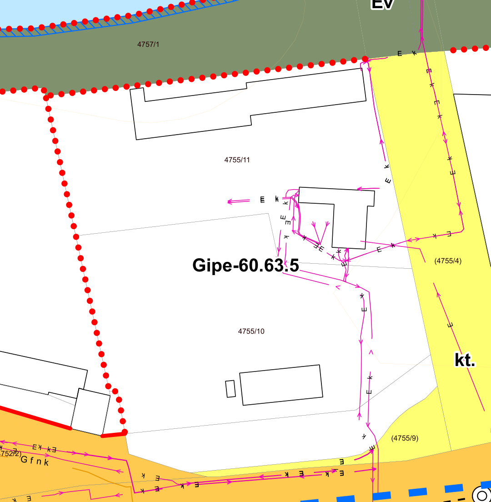

# Hivatalos források és saját jelmagyarázatok – 2026. október 9.

**A fő cél még nem teljesült: 0/5 teleknek van teljesen bizonyított, hatályos építési előíráslistája.**

96/96 offline automatikus teszt sikeres, beleértve a 36 eredeti tesztet és a
Streamlit vizsgálati útvonalát. Az öt mintatelek élő forrásvizsgálata után
62/62 forrásalapú ellenőrzés is sikeres: eredeti PDF-bájtok, NJT-források,
időállapotok, jelmagyarázat–tervlap kötés, feldolgozólenyomatok,
bizonyítottsági állapotok és a miskolci paraméterkód feloldása.
Ez a forráskezelés helyességét ellenőrzi; nem állít sikeres telekbesorolást.

| Telek | Pontos hivatalos HRSZ | Igazolt tervlapi telekgeometria | Teljes övezeti besorolás | Teljes hatályos előíráslista |
|---|---|---|---|---|
| Tiszaújváros 2200/8 | igen | nem | nem | nem |
| Budapest XII. kerület 8448/46 | igen | nem | nem | nem |
| Komádi 1558 | igen | nem | nem | nem |
| Gersekarát 034/15 | nincs pontos találat | nem | nem | nem |
| Miskolc 4755/11 | igen | igen, rajzi bizonytalanság: 1,07014 m | nem | nem |

## Saját hivatalos jelmagyarázat

A program a hatályos NJT-rendelethez hivatkozott külön jelmagyarázatot keresi,
ennek hiányában a terv beágyazott jelmagyarázatát. A saját felirat mellett
talált jelből olvassa ki a színt, kitöltést, vonalvastagságot, szaggatást és
a natív jelalak lenyomatát. Nincs országos szín- vagy vonaltípus-tábla.

| Település | Jelmagyarázat forrása | Automatikus övezethatár-jelminta |
|---|---|---|
| Tiszaújváros | [hivatalos terv](https://njt.jog.gov.hu/document/d9/d95fLL_EJR_81697536-rendelet_mell_klet-1.pdf), 2. PDF-oldal | két felbontású OCR-felirat és natív rajzi minta |
| Budapest XII. | [hivatalos terv](https://njt.jog.gov.hu/document/c3/c3f0LL_EJR_99708274-20250806_D-Hegyvid_k_K_SZ_1_mell_klet.pdf), 4. PDF-oldal | natív felirat és rajzi minta |
| Komádi | [hivatalos terv](https://njt.jog.gov.hu/document/29/29e9LL_EJR_109881483-tervlap_T_3_BELTERULETI_SZAB_2025_egyben.pdf), 1. PDF-oldal | két felbontású OCR-felirat és natív rajzi minta |
| Gersekarát | [hivatalos közigazgatási terv](https://njt.jog.gov.hu/document/ff/ffecLL_EJR_55522770-2._mell_klet_H_SZ.pdf), 1. PDF-oldal | a felirat felismerhető; a hozzá tartozó minta nem igazolt |
| Miskolc | [külön hivatalos jelmagyarázat](https://njt.jog.gov.hu/document/03/0366LL_EJR_83921015-Jelmagyarazat_modositasa.pdf), 1. PDF-oldal | natív felirat és beágyazott körjel |

A jelmagyarázat és a tervlap URL-je, eredeti SHA-256 lenyomata, PDF-oldala,
kiadása és településazonosítója a JSON-ban szerepel. Az eltárolt profil más
HRSZ-hez újrafelhasználható ugyanazon tervkiadáson belül. Másik terv vagy
módosított gyorsítótár nem kölcsönözhet jelöléseket. Tartós tárhely a
TELEKELOIRAS_LEGEND_CACHE_DIR változóval adható meg.

**A jelmagyarázat feldolgozása nem egyenlő a teljes övezetpoligon vagy minden
területi korlátozás felismerésével. Az országos megoldás még nem teljes.**
A raszteres minták megőrzése elkészült; teljes raszteres határrekonstrukció,
egyes CAD-minták és az összes telekspecifikus korlátozás ellenőrzése hiányzik.

## Tiszaújváros 2200/8

A Gip/3 tényleges telekhez tartozását nem sikerült sem bizonyítani, sem cáfolni.
A korábbi színalapú adapter besorolása letiltva, mert az új, saját
jelmagyarázat szerinti határfelismerési követelményt nem teljesíti.
A külön görbefelirat-próba a 35. PDF-oldalon három felbontásban azonosította
a 2200/8 HRSZ-t; ez feliratbizonyíték, nem igazolt telek- vagy övezetpoligon.

A felhasználó által kérdezett **Gip/3 övezet forrástábláját külön ellenőriztem**,
az algoritmus nem kapta meg ezt előre ismert telekbesorolásként:
szabadon álló beépítés; legnagyobb beépítettség 30%; legkisebb telekterület
10 000 m²; legkisebb zöldfelület 25%; legnagyobb épületmagasság 12,50 m.
A 2. lábjegyzet technológiai indokoltság esetére eltérést enged.
Forrás: [hatályos NJT-rendelet](https://njt.jog.gov.hu/jogszabaly/2018-11-SP-5Y1228)
2024.10.10. időállapot, [paramétertábla](https://njt.jog.gov.hu/document/af/afafLL_EJR_80774847-2._mell_klet.pdf)
2. PDF-oldal, lábjegyzet a 3. PDF-oldalon.
Ezek az övezet forrásadatai, alkalmazhatóságuk a 2200/8 telekre nem igazolt.

## Miskolc 4755/11

A hivatalos [terv](https://njt.jog.gov.hu/document/b4/b45dLL_EJR_127797597-Belteruleti_szabalyozasi_tervlapok_modositasa.pdf)
31. PDF-oldalán a pontos HRSZ és a zárt natív kataszteri CAD-telek együtt
azonosítható. A saját jelmagyarázat megnevezi ezt a rétegtípust; nyomtatott
színe/vastagsága eltér a jelmagyarázat mintájától, ezért a kataszteri adatot
a név szerint azonosított forrásréteg és a geometriavizsgálat igazolja.
Az övezethatárnál nincs ilyen névalapú kivétel: a saját körjel-alak egyezése kötelező.

A hatályos saját jelmagyarázat „Építési övezet, övezet határa, jele” sorában
a piros beágyazott körjel szerepel. A piros folytonos, 0,96 PDF-pont
vastagságú vonal külön sor szerint **szabályozási vonal**, ezért nem
használható fel övezeti sarok önkényes lezárására. Más településnél a
folytonos vagy szaggatott határ szerepét annak saját jelmagyarázata adja meg.

A natív körjelek tényleges középpontját a beágyazott betűkészletből számítja
a program. 3314 jel került feldolgozásra. Feliratok alatti hiányokat nem zár
kitalált vonallal, és a saját szabályozási/területi mintákat is vizsgálja.
A teljes, zárt övezetpoligon és a teljes telek kapcsolata nem igazolt.
A fő cél tehát ebben a fejlesztési lépésben sem teljesült.
A **Gipe-60.63.5 csak tervlapi jelölt**, nem igazolt besorolás.

A jelölt kódot az alkalmazás saját [hivatalos paraméterjelmagyarázatából](https://njt.jog.gov.hu/document/f3/f327LL_EJR_124216758-Param_terek_magyar_zata.pdf)
oldotta fel. A 60 nem 60%-os beépíthetőséget jelent:

| Kódpozíció | Forrás szerinti előírás | Érték |
|---|---|---|
| 1: 6 | legnagyobb épületmagasság | 12,5 m |
| 2: 0 | beépítési mód | adottságtól függő |
| 3: 6 | legnagyobb beépítettség | 50% |
| 4: 3 | legkisebb zöldfelület | 25% |
| 5: 5 | kialakítható legkisebb telekterület | 1200 m² |

Emellett a [2026.09.26. időállapotú rendelet](https://njt.jog.gov.hu/jogszabaly/2022-38-SP-5Y1070)
24., 25., 33. és 36. §-ából 20 teljes forrásbekezdés betöltődött, kiadás- és
szöveglenyomat-ellenőrzéssel. A teljes közművesítés, zöldfelületi feltételek,
rakodás, technológiai eltérések és hivatkozott országos szabályok feltételei
megmaradnak. A telekre/ügyre alkalmazhatóság külön igazolandó.


### Most ellenőrzött fejlesztések és konkrét hiányok

A többoszlopos jelmagyarázat hosszú feliratai mellett a következő oszlop
mintája tévesen kétértelművé tette az útterület-jelöléseket. A javítás legalább
három, ugyanebben a saját jelmagyarázatban igazolt, egy oszlophoz tartozó
natív sor alapján állapítja meg a minták oldalát. Egy magányos, kétoldali
mintát továbbra sem fogad el. A kétsoros felirat teljes magasságával dolgozik,
ezért nem cseréli le a magas útterületmintát a szomszéd oszlop mintájára.

A program közös, tényleges metszéspontokon csomópontosított gráfban dolgozza
fel a saját jelmagyarázattal egyező natív folytonos/szaggatott szakaszokat,
a natív pontsorokat és az igazolt út-/területkitöltések határait. Korábban
a külön feldolgozás miatt a vegyes határtípusok nem tudtak közös poligont
alkotni; ez javítva. Külön ellenőrzött teszt igazolja a PDF kifejezett
`h` záróparancsának natív szakaszként való kiolvasását. Hiányzó
zárószakaszt nem pótol a program. Ha egy ténylegesen felismert natív
határjel alakja vagy pontsora nem támogatott, a zárt natív vonalas terület
sem adhat igazolt besorolást: a fel nem dolgozható határ nem hagyható figyelmen kívül.
A lap széle és a feliratmaszk nem zárhat le övezetet.

### Konkrét tervlapi csatlakozásvizsgálat

A 31. PDF-oldal / 20-4 szelvény eredeti bájtjaiból újramért, a telekhez
legfeljebb két natív jelismétlési távolságra található nyitott végpontok:

| Nyitott végpont, PDF-pont (x; y) | Legközelebbi igazolt forráshatárig mért rés, PDF-pont | EOV-távolság |
|---|---|---|
| 309,627815; 476,334748 | 0,003131 | 0,004417 m |
| 312,674873; 478,988520 | 0,600543 | 0,847242 m |
| 400,342294; 468,207266 | 0,007697 | 0,010859 m |
| 313,921548; 478,230551 | 0,008733 | 0,012320 m |

A legközelebbi forrásgeometria nem feltétlenül a hiányzó övezeti csatlakozás
másik oldala. Ezek **résmérések**, nem bizonyított vonalösszetartozások.
Az eredeti pontok, a legközelebbi forráspont és a teljes szakasz WKT-je a
`reference-results.json` miskolci `closure_audit.topology` mezőjében vannak.
Az önálló forrásellenőrzés ismételten megnyitja az eredeti hivatalos PDF-et,
és újraszámítja a végpontokat, a távolságokat és a poligonzárást. A saját
hatályos jelmagyarázattal igazolt gráf nem ad feliratozott övezetpoligont
a teleknél; ez **nem cáfolja** a Gipe-60.63.5 besorolást, hanem a bizonyítás
sikertelenségét dokumentálja.

Az illesztési maradék 0,0701385 m, a konzervatív abszolút bizonytalanság
1,0701385 m. A telekhatár és az övezeti jelek ugyanazon natív PDF-rendszerben
vannak. A közös invertálható affine transzformáció megőrzi a metszéseket és
a fedési kapcsolatokat; ezért koordinátaeltolással nem lehet hitelesen
bezárni ezeket a forrásréseket. A forrásellenőrzés az invertálhatóságot és
a telekkoordináták visszaalakítását is ellenőrzi. A bizonytalansági sáv nem
felhatalmazás a telek más övezetbe történő átmozgatására.

**A fennmaradó akadály:** nincs bizonyított, jelenlegi saját jelmagyarázattal
értelmezett zárt övezeti terület, amely a teljes telket fedi. A natív PDF a
pontjel-sorozatok között nem ad közös sarokazonosítót vagy övezeti
vektortopológiát; a déli kitöltés hatályos jelváltozatként való használata
sem igazolt. A rendelkezésre álló PDF-ből ezek feltételezés nélküli pótlása
nem sikerült. Az akadály feloldásához a csatlakozásokat és a jelváltozatot
igazoló, hatályos hivatalos geometriára vagy egyértelmű tervi megfeleltetésre
van szükség. A város [hivatalos szabályzati oldala](https://www.miskolc.hu/varoshaza/onkormanyzat/strategiak-koncepciok/miskolc-megyei-jogu-varos-epitesi-szabalyzata)
az NJT-rendeletre hivatkozik; az oldalon talált partnerségi és korábbi
tervdokumentumok nem helyettesítik ezt a hatályos bizonyítékot.

A hatályos, külön jelmagyarázat közúti mintája RGB (1; 0,761; 0), miközben
a tervben a korábbi RGB (1; 0,796; 0,31) szerepel. Ennek forrását megtaláltam:
az [ugyanezen rendelet 2023.02.01. időállapotában](https://njt.jog.gov.hu/jogszabaly/2022-38-SP-5Y1070.0)
hivatkozott [saját korábbi jelmagyarázat](https://njt.jog.gov.hu/document/80/8042LL_EJR_40048648-1_MELLEKLET.pdf),
2. PDF-oldal, ugyanilyen megnevezésű közúti minta. A színérték három tizedesre
kerekítve egyezik. Ez a történeti jelváltozat eredetét igazolja; a hatályos
tervlapra való automatikus megfeleltetést és a teljes telekbesorolást még nem.
A részletes receiptek a [miskolc-legend-history.json](miskolc-legend-history.json)
fájlban vannak. Régi építési előírásokat nem alkalmaz a program.

A területi audit az építési vonal, védelmi, tilalmi és közműjelölések saját
mintáit vizsgálja. Azonos megjelenésű, eltérő jelentésű minták esetén minden
lehetséges saját feliratot megőriz. A kitöltés befoglaló téglalapja helyett
annak tényleges poligonját metszi a telekkel. A nem támogatott jelek és a
jogi védőtávolságok külön hiányként szerepelnek a JSON-ban és a Streamlitben.
Ez továbbra sem teljes területi korlátozásvizsgálat.



A kivágat a fent hivatkozott terv 31. PDF-oldaláról, a 20-4 szelvényről készült,
[300; 452; 435; 590] PDF-pont tartományban, nyolcszoros raszterezéssel.
A 4755/11 és 4755/10 telekfelirat, a közöttük húzódó telekhatár és a
Gipe-60.63.5 felirat külön látható. Ez a forrásképet dokumentálja,
a teljes geometriai besorolást önmagában nem igazolja.

A friss helyi HTML-forrásból 253 témabeli találat, 186 külön hivatkozható
rendelkezés megőrződött. Az öt paramétert, a 20 kapcsolódó bekezdést és a
kinyert helyi forrásleltárat a [miskolc-source-clauses.md](miskolc-source-clauses.md)
fájl tartalmazza. Az általános és más területek rendelkezéseit is tartalmazó
leltár nem tekinthető a 4755/11 teljes alkalmazható előíráslistájának.

## A további telkek

Budapest XII. 8448/46: pontos OÉNY-találat, saját natív jelmagyarázat; nincs
igazolt telekhatár–övezet kapcsolat. A MINERVA-adapter besorolása saját
jelmagyarázat szerinti vonalosztályozás nélkül letiltva.

Komádi 1558: pontos OÉNY-találat és a külön görbevonalas OCR-próbában pontos
tervlapi felirat az 1. PDF-oldalon; nincs igazolt telekgeometria vagy övezetpoligon.

Gersekarát 034/15: az OÉNY pontos keresése nem ad találatot, a 2019-es
közigazgatási terv OCR-próbája sem igazol pontos feliratot. Ez nem bizonyítja
a telek hiányát vagy átnevezését. A 2._mell_klet_H_SZ.pdf fájlnév ellenére
valódi tervlap; a korábbi téves mellékletválasztás javítva.

## Megismételhetőség

```sh
python -m unittest discover
python reference_checks.py --output work/reference-results.json
python validation/check_sources.py work/reference-results.json --history-report validation/miskolc-legend-history.json --output work/source-check-results.json
python reference_checks.py --outlined --output work/reference-outlined-results.json
```

reference-results.json: aktuális öttelekes vizsgálat és forrásreceiptek.
source-check-results.json: 62 sikeres ellenőrzés, a jelentés lenyomatával.
reference-outlined-results.json: külön HRSZ-feliratpróba, saját forrás- és
feliratfeldolgozó-lenyomatokkal; nem övezeti bizonyíték.
conditional-zone-parameters.json: a Gip/3 forrássor feltételes ellenőrzése.
test-results.json: helyi tesztfutás. A GitHub Actions külön futtatja a teljes
offline csomagot a meglévő PR #1-en.
